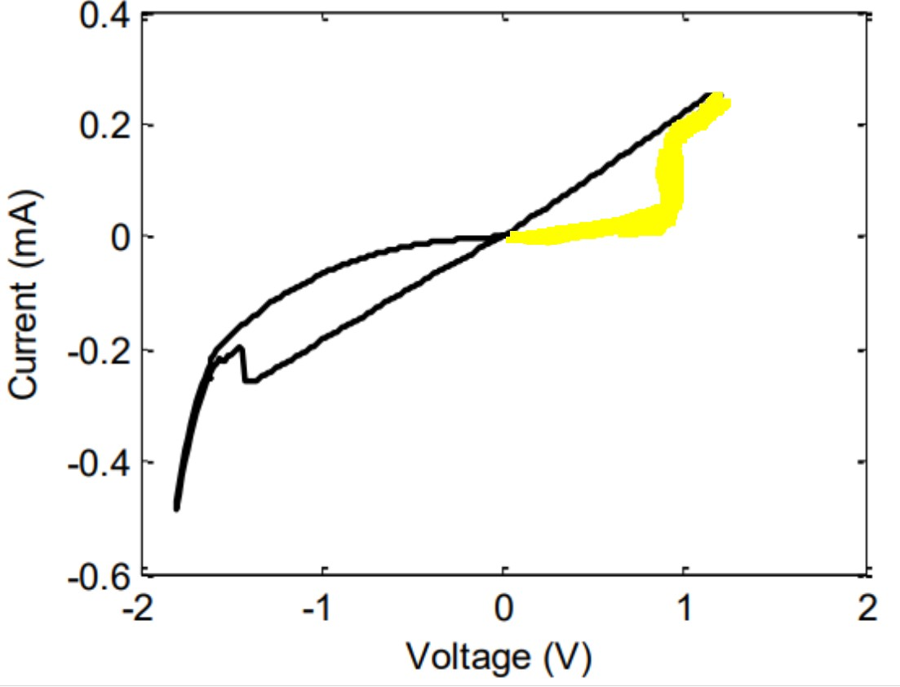
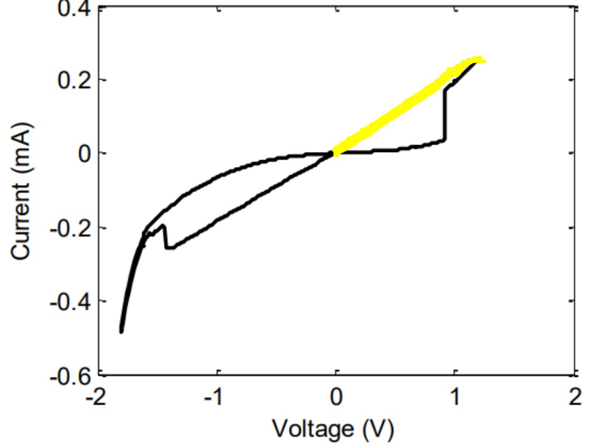
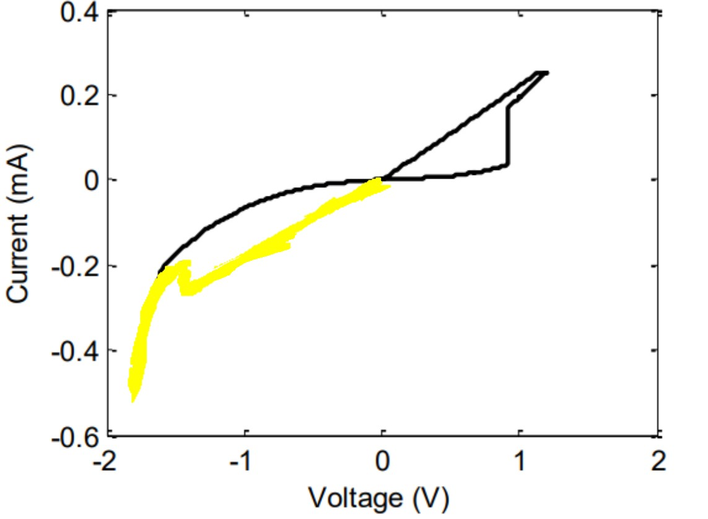
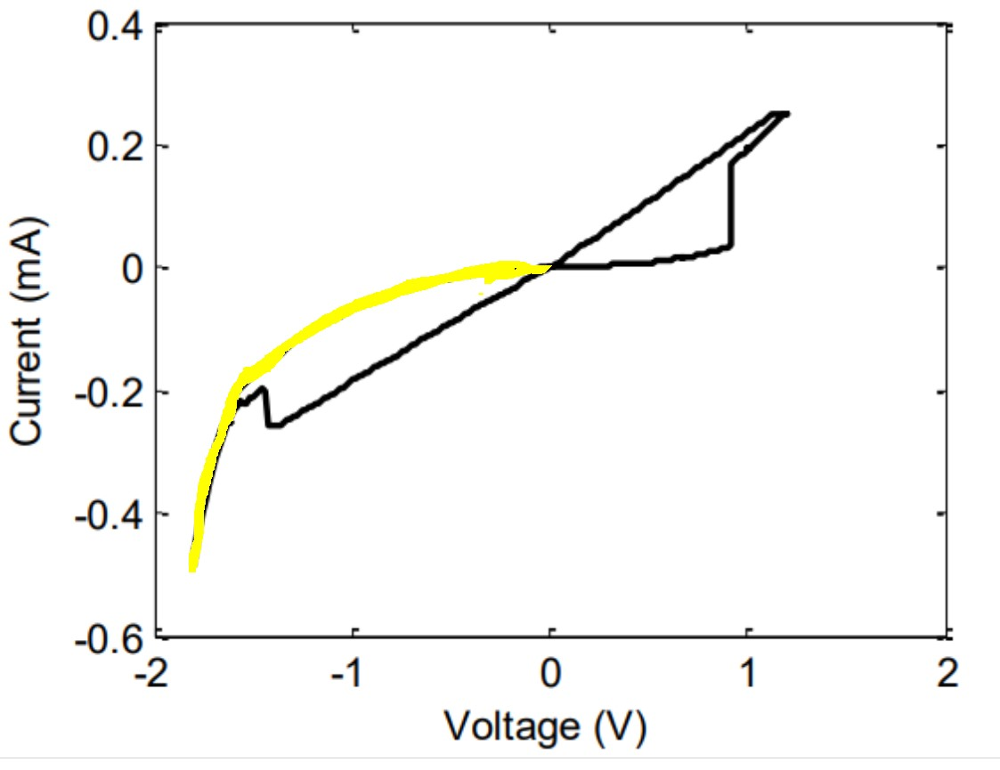
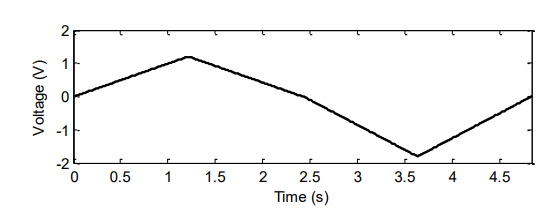

# Error-Calculation
RMSE Error Estimation for Memristive Devices

To estimate error we presume that the experimental data is collected from a paper and then the data points are extracted using a WebPlotDigitizer. Two main issues arise when trying to compare simulated and experimental data in such fashion which are:
* WebPlotDigitizer inherently sorts the x-axis points for which the positive and negative sweep are indistinguishable.
* Data points present in experimental and simulated results are not the same

Such discrepencies are dealt with in this script. To tackle the first problem while extracting points from WebPlotDigitizer the points are to be extracted in four chunks instead extracting all at once.

  
  

  
  

Upon extracting points in the manner described above, four csv files are generated which are sequentially named such as <strong>Hf1.csv, Hf2.csv</strong> etc. It is to be noted that, for the script to work properly the csv files should be ordered and must end with the appropiate digit. Again, the simulated data is expected in <strong>Simulated.mat</strong>strong> file which will include <strong>V</strong>strong>,<strong>I</strong> and  <strong>t</strong>strong> variables.

Once, all the necessary files are uploaded run the entire notebook and the error will be displayed. Example files are included in the repository to familiarize oneself with the necessary files required for this notebook.

Important Notes:
* Upon calculating error delete the uploaded files before calculating error for another batch
* Simulated and Experimental results should have consistent units
* The script takes into account the following characterization input. Changes are required for characterization inputs which are not analogous to the one presented below:

